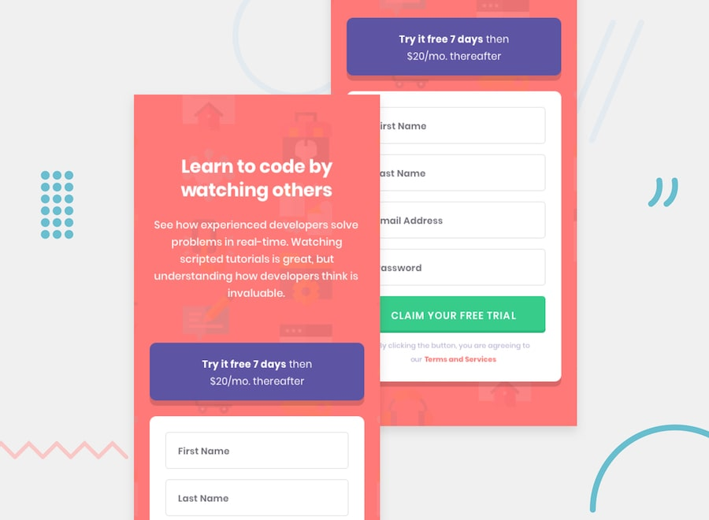

This is a solution to a **Frontend Mentor** challenge, focused on creating a clean, responsive signup form that closely matches the provided design.

## Reference

- [Frontend Mentor challenge](https://www.frontendmentor.io/challenges/intro-component-with-signup-form-5cf91bd49edda32581d28fd1)
- [Figma design](https://www.figma.com/design/e1E0ehhRIiBcnfQaH1CJl1/intro-component-with-signup-form?node-id=0-1&p=f&t=Ybhx93KZiLnY1MzD-0)

